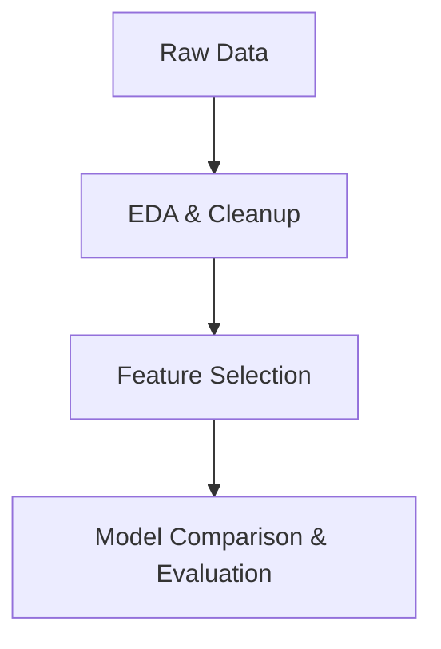

# Thyroid Disease Classification Models in Python

## Project Overview

This project evaluates and compares multiple classification algorithms (GLM/Logistic Regression, SVM, Random Forest, KNN) for predicting thyroid disease using clinical and laboratory data. The analysis is framed both from a data science and medical perspective, 
with a particular emphasis on model interpretability, generalization, and practical utility.
- The workflow includes data cleaning, feature selection, model training, hyperparameter tuning, and evaluation, all designed for clinical interpretability and reproducibility. 
- The goal is to identify the best predictive model and the most clinically relevant features for thyroid disease classification.

---

### **Purpose**

- **Clinical Motivation:** Early and accurate classification of thyroid disorders is crucial for patient management. This project automates the diagnosis using machine learning.
- **Technical Goal:** To compare the performance of different classification algorithms (GLM, SVM, Random Forest, KNN) in Python.

---

## **Data Description**

- **Source:** [UCI Machine Learning Repository – Thyroid Disease Data Set](https://archive.ics.uci.edu/ml/datasets/thyroid+disease)
- **Sample Size:** 3772 patients, 31 features (demographic, clinical, lab results).
- **Target:** Binary classification – Thyroid disease (`1`) vs. No disease (`0`).
- **Data Location:** `data/thyroidSourceData.csv`

| Feature Type    | Examples                                   |
|-----------------|--------------------------------------------|
| Demographics    | age, sex                                   |
| Medical History | on_thyroxine, thyroid_surgery, tumor, etc. |
| Lab Results     | TSH, T3, TT4, FTI, etc.                    |
| Target          | thyroid (binary outcome)                   |

**Note on Data Imbalance:**  
The dataset exhibits class imbalance, with far more negative (no disease) cases than positives. Because of this, **ROC-AUC** is the primary metric for model selection, as it is robust to imbalance. Additional metrics such as precision, recall, and F1-score are also reported for comprehensive evaluation.

---

## **How**

The entire project is modularized into three main Jupyter notebooks (scripts):

---

## **Summary Table: Data Flow & Outputs**

| Script                                      | Input File                          | Output File                               | Key Visuals/Outputs                  |
|----------------------------------------------|-------------------------------------|-------------------------------------------|--------------------------------------|
| `00_Thyroid-Classfication_cleanup_EDA.ipynb`   | `data/thyroidSourceData.csv`        | `cleanThyroidData.csv`                    | Data overview, missingness, boxplots |
| `01_featureSelection_Regularization.ipynb`      | `cleanThyroidData.csv`              | `data/thyroidData_Lasso_featureselected.csv` | Feature importance barplot, LASSO plot |
| `02_modelTuningSelectionEvaluation.ipynb`        | `data/thyroidData_Lasso_featureselected.csv` | N/A (metrics in notebook)            | ROC curves, boxplots, confusion mat. |

---

## **Key Steps and Building Blocks**

### **1. Data Cleaning & EDA**
- Handle missing values, outlier detection and treatment.
- Standardize categorical encodings (e.g., 'F'/'M' → 'Female'/'Male', 't'/'f' to boolean).
- Visualize feature distributions, correlations, and missingness.

> _Example: Missing value matrix and outlier boxplots for numeric features._

### **2. Feature Selection**
- Use **LASSO logistic regression** to select most predictive features.
- Export a reduced dataset for efficient modeling.
- Interpret and visualize feature importances.

> _Example: Bar chart of absolute LASSO coefficients for top features._

### **3. Model Training, Tuning, and Evaluation**
- Compare four classifiers: **GLM (Logistic Regression), SVM, Random Forest, KNN**.
- Use **cross-validation** and **GridSearchCV** for hyperparameter tuning.
- Evaluate metrics: **ROC-AUC** (primary, robust to class imbalance), **accuracy, precision, recall, F1**.
- Visualize **ROC curves**, **cross-validated AUCs**, **confusion matrices**.

---

## **Results / Conclusion**

- **Best Model:** Random Forest achieved the highest ROC-AUC and F1, with strong precision/recall balance.
- **Key Predictors:** TSH.
- **Feature Selection:** LASSO reduced feature space from 31 to ~13 without loss in predictive performance.

| Model         | Test AUC | Accuracy | Precision | Recall | F1    |
|---------------|----------|----------|-----------|--------|-------|
| GLM           | 0.978    | 0.949    | 0.82      | 0.51   | 0.63  |
| SVM           | 0.987    | 0.961    | 0.90      | 0.61   | 0.73  |
| Random Forest | 0.998    | 0.984    | 0.90      | 0.91   | 0.90  |
| KNN           | 0.979    | 0.961    | 0.84      | 0.66   | 0.74  |

---

## **How to Use / Reproduce**

1. **Clone the repository** and ensure you have Python 3.8+ and requirements (see `requirements.txt`).
2. **Run scripts sequentially:**  
   a. EDA and cleanup  
   b. Feature selection  
   c. Model selection & evaluation  

---

## **Acknowledgments**

- Data: [UCI ML Repository](https://archive.ics.uci.edu/ml/datasets/thyroid+disease)
- Author: **Ashutosh Shirsat**
- Contact: [GitHub Profile](https://github.com/Hsotuhsa-S)

---

_This project is open-source and designed as a learning and portfolio resource for Data Science and ML roles._
